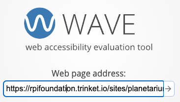
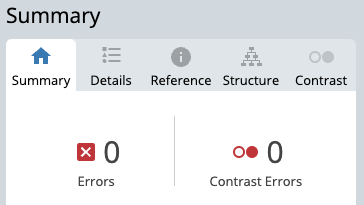

Accessibility tools check that your website can be viewed by people with disabilities. 

Click on the `Published` button:

Right-click on the `Site URL` link and choose `Copy Link Address`:

Go to the [WAVE Web Accessibility Evaluation Tool](https://wave.webaim.org/){:target="_blank"} website and paste in your published site URL then click on the arrow:

The aim is to have zero contrast errors:

If contrast errors are reported, click on the Contrast tab and use the sliders to change the foreground or background colours until they pass the test: 

Copy the new hex codes and replace them in the colour variables of your mood board web page. 
